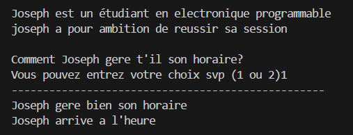

Joseph est une étudiant en électronique programmable qui a pour ambition de valider sa session.

## Utilisateur
# Fonctionnalité
- Histoire intéractif
- Des questions logiques menant à une serie de reponses
- 
# Limitations
- Choix limités à (1 ou 2)
- 
# Installation
- Installation python
- Télécharger le fichier Projet_joseph.py
- 
# FAQ
- Que faire si je me trompe de touche?
le programme repose la même question automatiquement 
- Que faire si le programme bug?
refaire l'installation du fichier Projet_projet.py

# Communauté
- etudiant du Cegep
- passionnés d'histoire intéractive
  
# Table des matières
###

# Utilisation
###

# Resumé du projet
le programme affiche une serie de question
l'utilisateur doit choisir une option entre (1 ou 2)
chaque choix influence l'histoire de Joseph.

# Example
-Comment Joseph gère t'il son horaire?
-choix_1
-Joseph gère bien son horaire.
-Joseph arrive a l'heure.

# Sreenshot

## Programmeur

# Créer son environnement de developpement
- Installer Python
- Utiliser VS code
- Activer l'extension Python

# Lien vers ressource externe

# Comment régler des problèmes
- Si le programme plante: Vérifier les indentations
- Si les choix ne fonctionnent pas: Verifier le "Return"
- Si la question ne s'affiche pas: Vérifier l'appel à "demander_choix".

# Versionnage
- une seule version complète

# Test
- Tester chaque question de façon individuelle
- Tester les intrées invalid tel que des lettres ou des chiffres autres que 1 ou 2

# Problèmes connus
- l'itulisateur peut saisir un texte

# Calendrier de fonctionnalité à venir
- faire des interfaces graphiques
- Ajout des couleurs dans le terminal

# Chose à venir
- Ajouter plus de scénario

# Dépendance
- le programme n'a aucune dépendance externe
- le programme utilise uniquement Python standard.

# Requis
Python 3.10 et plus
terminal fonctionnel

## Légal

# Licence
- Projet éducatif libre d'itulisation dans un cadre scolaire

# Contribution
- les contributions sont acceptées:
- Ajout de question
- Amélioration du code
- Correction de bugs

# Remerciement
- Enseignant du cour de programmation 1 au Cegep de Sherbrooke
- Mes collegues du groupe 21181
- Joseph_Boka developpeur du projet

